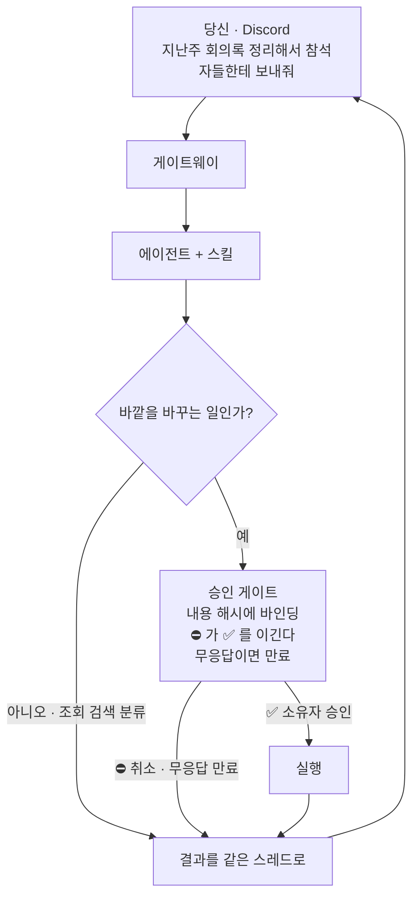

<div align="center">

# autophagy-agents

**연구자 한 사람이 자기 노드에서 돌리는 개인 에이전트 시스템.**<br>
메일·일정·회의록·과제비·노트를 대신 처리하지만, **내가 ✅ 를 누르지 않은 일은 절대 하지 않습니다.**

[](LICENSE)
[](#필요한-것)
[](#필요한-것)
[](https://github.com/orientpine/cytoplasm/tags)
[](#업데이트는-서명된-것만-설치됩니다)
[](#승인-게이트가-실제로-막는-것)

[빠른 시작](#빠른-시작) · [무엇을 할 수 있나요](#무엇을-할-수-있나요) · [동작 방식](#동작-방식) · [FAQ](#자주-묻는-질문) · [보안](SECURITY.md)

</div>

---

## 한눈에

에이전트에게 진짜 권한을 주면 곧바로 무서워집니다. 메일을 대신 써 주는 건 반갑죠. 그런데 내가
모르는 사이에 **보내 버리는** 건 전혀 다른 이야기잖아요.

그 두려움을 설계로 풀었습니다. 읽는 일은 마음껏 하되, 바깥 세상을 바꾸는 일은 전부 소유자 앞에
카드로 올라옵니다. 대충 이런 모습이에요.

```text
📬 메일 발송 승인 요청                                    #agent-chat › 메일 · 예산 문의 회신
──────────────────────────────────────────────────────────────────────────────
받는 사람 : (수신자)
제목      : Re: 2분기 집행 계획 문의
본문 요약 : 첨부한 표대로 진행하되, 항목 3은 다음 주에 다시 확인하겠다는 취지

action_hash : sha256:7f3c…a19b
만료        : 24시간 뒤 자동 취소

                                                              ✅ 보낸다   ⛔ 취소
```

✅ 를 누르면 그때 메일이 나갑니다. 아무것도 누르지 않으면 만료돼요. 승인한 뒤에 본문이 한 글자라도
바뀌면 해시가 어긋나 실행되지 않고요. 이 카드 하나가 저장소 전체의 요약입니다.

> [!IMPORTANT]
> **모든 외부효과는 소유자 본인의 승인을 거칩니다.** 이 한 문장이 설계의 중심이고, 나머지
> 코드는 대부분 그 불변식을 지키려고 존재해요.

---

## 목차

- [한눈에](#한눈에)
- [왜 이렇게 만들었나요](#왜-이렇게-만들었나요)
- [무엇을 할 수 있나요](#무엇을-할-수-있나요)
- [빠른 시작](#빠른-시작)
- [동작 방식](#동작-방식)
- [승인 게이트가 실제로 막는 것](#승인-게이트가-실제로-막는-것)
- [업데이트는 서명된 것만 설치됩니다](#업데이트는-서명된-것만-설치됩니다)
- [연합 모델 — 각자 자기 설치를 소유합니다](#연합-모델--각자-자기-설치를-소유합니다)
- [저장소 구조](#저장소-구조)
- [자주 묻는 질문](#자주-묻는-질문)
- [기여하기](#기여하기)
- [보안·버전·지원](#보안버전지원)
- [라이선스](#라이선스)

---

## 왜 이렇게 만들었나요

자동화에는 서로 잡아당기는 두 요구가 함께 붙어 있습니다. 사람이 매번 지켜보지 않아도 일이
굴러가야 하고, 동시에 **사람이 허락하지 않은 일은 결코 벌어지지 않아야** 하죠. 둘 다 지키려고
이 시스템은 네 가지를 택했습니다.

| 원칙 | 무슨 뜻인가 |
|---|---|
| **읽기는 자유, 쓰기는 게이트** | 조회·검색·분류는 그냥 한다. 메일 발송, 일정 등록, 문서 저장, 스킬 배포는 소유자의 ✅ 뒤에만 실행. 승인은 내용 해시에 묶여 있어서 승인 후 내용이 바뀌면 거부된다 |
| **막히면 멈춘다 (fail-closed)** | 설정이 없거나, 권한을 확인할 수 없거나, 판단이 모호하면 그냥 하지 않는다. 조용히 넘어가는 샛길을 일부러 만들지 않았다 |
| **커밋됨 ≠ 배포됨** | 프로덕션에서 도는 것은 불변 릴리스. 업데이트는 **서명된 릴리스 태그**에만 수렴하고, 실패하면 되돌린 뒤 소유자에게 알린다 |
| **신뢰 근원은 손이 닿지 않는 곳에** | 승인 판정과 서명 검증이 읽는 파일은 root 소유. 에이전트 계정이 그 파일을 고칠 수 있다면 검증 전체가 연극이 된다 |

이 네 줄은 문서로만 있는 약속이 아니에요. 각각을 지키는 테스트가 있고, 어기는 코드는 CI 에서
빨간불이 켜집니다.

---

## 무엇을 할 수 있나요

스킬 하나가 업무 영역 하나를 맡습니다. **승인** 열이 ✅ 면 실행 전에 반드시 카드가 올라온다는
뜻이에요.

| 스킬 | 하는 일 | 승인 |
|---|---|:---:|
| `mail` | 기관 웹메일 읽기·분류, 아침 다이제스트, 회신·새 메일 초안 작성 | ✅ 발송 |
| `calendar` | 일정 조회는 즉시, 등록·수정은 게이트 경유 | ✅ 등록 |
| `meeting` | 회의록 생성 — 결정사항·액션아이템·관리번호·과제별 원장까지 | ✅ 발행 |
| `speechtotext` | 녹취를 전사본으로. 화자 분리·이름 배정 포함, 음성은 노드 밖으로 나가지 않음 | — |
| `plaud` | 라이프로그 녹음을 노트로 만들어 개인 볼트에 넣기 | ✅ 쓰기 |
| `recall` | 개인 RAG 검색. 특허 민감 자료는 검증된 경로에서만 | 읽기 전용 |
| `wiki` | 개인 위키와 의사결정 트윈(판단 근거) 관리 | ✅ 쓰기 |
| `doctype` | 문서를 어디에 저장할지 결정론적으로 라우팅 | ✅ 저장 |
| `budget` | 과제비 원장 조회와 변경 감지, 지출 리포트 | — |
| `todo` | 할 일 등록·조회 | ✅ 등록 |
| `proposal` | 제안서 워크스페이스와 HWPX 문서 렌더링 | ✅ 산출 |
| `procurement` | 구매·조달 절차 안내와 서류 준비 | ✅ 산출 |
| `patent-prep` | 특허 준비 자료 정리 (민감도 게이트 상시 적용) | ✅ 반출 |
| `report` | 보고서 초안과 정기 리포트 | ✅ 산출 |
| `coordination` | 다른 연구자 에이전트와 일정 조율 (교착·재협상 규칙 포함) | ✅ 확정 |
| `repair` | 오류·실패를 수리 티켓으로 만들고 패치와 PR 까지 | ✅ 적용 |
| `topics` · `prompt` | 관심 주제 추적, 프롬프트 자산 관리 | — |
| `hello-autophagy` | 스킬 구조를 보여주는 데모. 새 스킬은 여기서 출발 | — |

스킬은 직접 만들어 붙일 수 있어요. 배포는 샌드박스 → 리뷰 → 소유자 ✅ → 마운트의 4단계를
거칩니다. 자세한 목록과 상태는 [`docs/features.md`](docs/features.md), 스킬 작성 규약은
[`skills/AGENTS.md`](skills/AGENTS.md) 를 보세요.

---

## 빠른 시작

### 필요한 것

| 항목 | 값 |
|---|---|
| 운영체제 | **Linux + systemd** (리컨실러·워처가 systemd 타이머) |
| 권한 | 설치에 `root`. 계획 확인(dry-run)은 root 없이 가능 |
| 파이썬 | 3.12 이상 |
| 그 밖에 | Discord 앱·봇, 모델 provider, Hermes 게이트웨이, 업데이트 신뢰키 |

전제 준비의 정본은 [`docs/guide/third-party-runtime-prereqs.md`](docs/guide/third-party-runtime-prereqs.md)
입니다. 처음 받은 분은 표지 문서 [`docs/guide/quickstart-install.md`](docs/guide/quickstart-install.md)
부터 펼치세요. 설치 절차 전체의 단일 진실은 [`docs/guide/install.md`](docs/guide/install.md) 이고요.

### 1단계 — 지문부터 대조합니다

`<bundle>/update-trust.pub` 은 각 릴리스에 asset 으로 동봉되는 업데이트 신뢰키의 공개키예요.
그 지문은 이 README 와 릴리스 노트에 공지되는데, **키와 다른 경로로 받은 지문**을 설치기에
넘겨 대조하는 것이 이 부트스트랩의 핵심입니다. 마법사도 설치기도 지문을 지어내지 않아요.

```
SHA256:0imCAjLaEFCB8oNX05/7mHFQAZsL722KIEZsVD5yvrA
```

사람이 직접 판단해야 하는 지점은 사실상 여기 하나뿐입니다.

### 2단계 — 설치 마법사 (권장)

```bash
python3 -m automation.install.wizard \
    --update-trust-key <bundle>/update-trust.pub \
    --expect-update-trust-fingerprint 'SHA256:0imCAjLaEFCB8oNX05/7mHFQAZsL722KIEZsVD5yvrA'
```

마법사는 프로필(`core`·`rag`·`report-hub`·`full`), 업데이트 origin URL, 호스트 이름, 운영자
계정을 묻고 `~/.config/autophagy/node.toml` 을 대신 써 줍니다. 그다음 root 없이 설치 계획을
받아 한국어 요약을 보여주고, `yes` 를 입력해야만 `sudo` 로 실제 설치에 들어가요. 설치 로직은
여전히 아래 설치기 하나가 소유합니다 — 마법사는 그 인자를 조립할 뿐이죠.

- `--profile core` 처럼 값을 미리 주면 그 질문은 건너뜁니다. `--config PATH` 로 위치를 바꾸거나
  이미 있는 config 를 그대로 재사용해도 되고요.
- `--dry-run-only` 는 계획 확인에서 끝납니다(`sudo` 0회). `--yes` 는 비대화 실행 전용이에요.
- 확인 질문에 `n` 을 답하면 rc 3 으로 멈추고 아무것도 설치하지 않습니다.

### 3단계 — 설치기 직접 실행 (스크립트·수동)

config 를 [install.md §3](docs/guide/install.md) 대로 손으로 쓰거나, 마법사가 만든 파일을 그대로
주고 같은 설치기를 부르세요.

```bash
# 무엇이 설치될지 먼저 봅니다 — root 불필요, 아무것도 쓰지 않습니다
python3 -m automation.install \
    --config ~/.config/autophagy/node.toml \
    --profile core \
    --update-trust-key <bundle>/update-trust.pub \
    --expect-update-trust-fingerprint 'SHA256:0imCAjLaEFCB8oNX05/7mHFQAZsL722KIEZsVD5yvrA' \
    --dry-run

# 실제 설치 — 멱등입니다. 막히면 고치고 같은 명령을 다시 실행하세요
sudo python3 -m automation.install \
    --config ~/.config/autophagy/node.toml \
    --profile core \
    --update-trust-key <bundle>/update-trust.pub \
    --expect-update-trust-fingerprint 'SHA256:0imCAjLaEFCB8oNX05/7mHFQAZsL722KIEZsVD5yvrA'
```

`--profile` 은 이 노드가 운영하는 묶음의 헬스체크 선언을 root 소유 파일로 고정해요. 생략하면
이전과 같은 계획입니다.

설치가 끝난 뒤의 사용법은 [`docs/guide/manual-member.md`](docs/guide/manual-member.md) 가 이어받습니다.

---

## 동작 방식



요청 하나에 스레드 하나가 열립니다. 승인 카드도, 리마인더도, 실행·취소·만료 결과도 전부 그
스레드 안에서 끝나요. 끝나면 이름에 상태가 붙어 보관되고요. 그래서 **열려 있는 스레드 목록이
곧 진행 중인 일 목록**이 됩니다.

<details>
<summary><b>메일 한 통이 나가기까지 — 단계별로 펼쳐 보기</b></summary>

1. **수신·분류** — 받은 메일을 읽고 민감도를 먼저 판정해요. 특허 민감 자료는 검증된 경로가
   아니면 모델 호출 자체를 하지 않습니다.
2. **다이제스트** — 아침에 요약 한 건이 옵니다. 여기까지는 읽기라서 승인이 필요 없어요.
3. **초안** — "이렇게 답장해 줘" 라고 지시하면 회신 초안을 만듭니다. 회신에는 원문 인용이
   자동으로 붙고요.
4. **고유명사 확인** — 받는 사람이 이름으로만 적혀 있으면 주소를 추측하지 않아요. 주소록과
   대조해 확신이 설 때만 정규화하고, 애매하면 되묻습니다.
5. **승인 카드** — 수신자·제목·본문 요약과 `action_hash` 가 함께 올라옵니다.
6. **✅ 또는 ⛔** — 소유자 본인의 리액션만 유효해요. 봇이나 다른 사람의 반응은 무시되고,
   ✅ 와 ⛔ 가 함께 있으면 취소로 처리합니다.
7. **실행과 통지** — 발송한 뒤 결과가 같은 스레드로 돌아오고, 감사 원장에 한 줄 남습니다.

중간에 무엇 하나라도 확인되지 않으면 그 자리에서 멈춰요. 이것이 fail-closed 입니다.

</details>

---

## 승인 게이트가 실제로 막는 것

| 상황 | 어떻게 되나 |
|---|---|
| 승인 뒤 내용이 바뀜 | 해시가 어긋나 **실행되지 않는다** |
| 소유자가 아닌 사람이 ✅ | 무시. 리액션 주체와 봇 여부를 확인한다 |
| ✅ 와 ⛔ 가 함께 | **취소**로 처리 (외부효과는 안전한 쪽으로) |
| 아무도 누르지 않음 | 만료. 만료도 결과라서 스레드로 통지된다 |
| 같은 요청이 두 번 게시됨 | 게시하지 않는다. 요청 하나에 카드 하나가 강제된다 |
| 설정·권한을 읽을 수 없음 | 실행하지 않는다. 판단 불가는 승인이 아니다 |

승인 이모지는 어느 스킬에서나 같아요 — **✅ 는 실행, ⛔ 는 취소.** 외울 것은 이 둘뿐이고,
봇이 미리 붙여 두므로 탭 한 번이면 됩니다.

---

## 업데이트는 서명된 것만 설치됩니다

자동 업데이트는 편하죠. 하지만 잘못 만들면 "저장소에 push 할 수 있는 사람 = 내 노드에서 root 로
코드를 돌릴 수 있는 사람" 이 됩니다. 그래서 무엇을 설치할지는 **서명만이** 정해요.

- 노드의 리컨실러는 2분마다 돌지만, 설치 대상을 **인자로 받지 않습니다.** 게시된 릴리스 태그 중
  검증에 통과한 가장 최신 것으로만 수렴하죠.
- 서명 검증에 실패하면 그 틱은 아무것도 하지 않고 안전하게 건너뜁니다.
- 롤백 방지 앵커가 있어서 옛 릴리스를 다시 밀어 넣는 강제 다운그레이드가 막혀요. 문제가 있는
  릴리스는 되돌리는 게 아니라 **더 높은 버전으로 앞질러 고칩니다.**
- 서명 개인키는 어떤 저장소에도, 어떤 노드에도, CI 에도 두지 않아요. 노드에 놓이는 것은
  공개키 한 줄뿐입니다.

소프트웨어 업데이트와 스킬 배포는 **완전히 다른 채널**이에요. 스킬은 받아 두는 것까지만 자동이고,
실제로 켜는 일(live 마운트)은 언제나 그 설치 소유자의 ✅ 입니다.

---

## 연합 모델 — 각자 자기 설치를 소유합니다

여러 연구자가 함께 써도 **중앙 서버도, 멀티테넌트 호스팅도, 공용 계정도 없습니다.** 각자 자기
호스트에 자기 설치를 갖죠. 자기 봇, 자기 자격증명, 자기 데이터, 그리고 자기 승인 게이트.

그러면 "그룹"이란 무엇일까요? 그룹은 서비스가 아니라 **공급망·정책 경계**이고, 물리적 구성물은
정확히 셋뿐입니다.

1. 그룹 관리자가 소유한 **관리형 스킬 저장소**
2. 관리자의 **서명키 1쌍** — 개인키는 관리자만, 팀원은 공개키만 갖는다
3. **roster** — 팀원 명단

이 셋 말고 그룹을 표현하는 서버나 DB 는 없고, 앞으로도 만들지 않아요. 그래서 그룹 관리자가
**할 수 없는 일**이 분명합니다.

- 팀원 설치의 외부효과를 **대리 승인할 수 없어요.** 승인 게이트는 팀원 본인 것이니까요.
- 팀원의 자격증명·메일·노트·대화를 **볼 수 없습니다.**
- 이미 팀원 노드에 올라간 스킬은 **원격으로 거둬들이지 못합니다.** 관리자의 권한은
  배포 키 폐기와 취소(revocation) 발행까지. 실제 제거는 그 설치의 소유자 몫이에요.

마지막 항목은 결함이 아니라 "각자 자기 설치를 소유한다"의 직접적인 귀결이에요. 두 채널이
서로 다르다는 점도 중요합니다 — **소프트웨어 업데이트는 업스트림에서 직접** 받고, **스킬은 그룹
관리자에게서** 받아요. 그룹 관리자가 소프트웨어 유지보수자일 필요는 없습니다.

한 설치는 v1 에서 하나의 그룹에만 속해요. 역할별 매뉴얼은 따로 있습니다 —
[팀원](docs/guide/manual-member.md) · [그룹 관리자](docs/guide/manual-group-admin.md) ·
[유지보수자](docs/guide/manual-maintainer.md).

---

## 저장소 구조

```text
configs/        # 노드 config·라우팅 정책·환경 템플릿 등 설정 시드
skills/         # 에이전트 스킬 (메일·캘린더·문서·위키·할일 …)
automation/     # 오케스트레이션·승인 게이트·워처·배포·설치기
  install/      # 단일 노드 설치기 (python3 -m automation.install)
prompts/        # 프롬프트 자산
tests/
  unit/         # 단위 테스트
  e2e/
    scenarios/  # E2E 시나리오
docs/
  guide/            # 가이드 문서 (설치·전제·운영·규약)
  patch/            # 패치 노트
  기능소개/          # 기능별 소개 (무엇을·왜·어떻게 쓰는가)
  troubleshooting/  # 트러블슈팅
logs/           # 로그 (git 미추적, 디렉토리만 유지)
```

`.omo/`(계획·오케스트레이션 상태)와 `docs/qa/`(QA 증적)는 비공개 개발 저장소 전용이라 공개
배포본에는 들어 있지 않아요.

설계 규약과 코드 지도는 [`AGENTS.md`](AGENTS.md) 에 있습니다. 이 저장소에서 무언가를 고칠
생각이라면 그 문서를 먼저 읽는 편이 빨라요.

---

## 자주 묻는 질문

<details>
<summary><b>중앙 서버가 필요한가요?</b></summary>

필요 없어요. 설치 하나가 곧 완결된 시스템입니다. 여러 명이 함께 쓰더라도 공유되는 것은
스킬 저장소·서명키·명단 셋뿐이고, 그마저도 그룹을 쓸 때만 필요하죠.

</details>

<details>
<summary><b>그룹 관리자가 제 메일이나 노트를 볼 수 있나요?</b></summary>

볼 수 없습니다. 자격증명도 데이터도 각자의 호스트에만 있으니까요. 관리자가 보내는 것은 서명된
스킬 릴리스이고, 그것을 켤지 말지도 받는 사람이 정해요.

</details>

<details>
<summary><b>승인을 깜빡하면 어떻게 되나요?</b></summary>

만료됩니다. 만료도 하나의 결과라서 요청 스레드로 통지가 돌아오고, 실행은 일어나지 않아요.
급하지 않은 일이 조용히 사라지는 게 아닙니다. 조용히 **안 한 채로** 끝나죠.

</details>

<details>
<summary><b>승인한 뒤에 내용이 바뀌면요?</b></summary>

실행되지 않아요. 승인은 내용의 sha256 해시에 묶여 있어서, 실행 직전에 다시 계산한 해시가
다르면 그 자리에서 거부합니다. "승인은 받았으니 조금 고쳐서 보내자" 가 불가능한 구조죠.

</details>

<details>
<summary><b>음성 녹취나 문서가 외부로 나가나요?</b></summary>

전사는 기본적으로 노드 안에서 로컬 모델로 처리해요. 민감도 게이트는 텍스트를 보기 때문에,
원음을 외부 API 로 보내는 경로는 게이트보다 **앞에** 놓이지 않도록 따로 막아 두었습니다.
특허 민감으로 분류된 자료라면 검증된 경로가 아닌 한 모델 호출 자체를 하지 않고요.

</details>

<details>
<summary><b>Windows 나 macOS 에서도 되나요?</b></summary>

아니요. Linux + systemd 전용이에요. 리컨실러와 워처가 systemd 타이머라서, systemd 없는
환경에서는 계획 확인(dry-run)까지만 의미가 있습니다.

</details>

<details>
<summary><b>스킬을 직접 만들 수 있나요?</b></summary>

만들 수 있어요. `skills/hello-autophagy/` 가 최소 예제이고, 배포는 샌드박스 → 리뷰 →
소유자 ✅ → 마운트의 4단계를 거칩니다. 이미 비슷한 스킬이 있으면 만들기 전에 그것을
알려주는 대조 게이트도 있고요.

</details>

<details>
<summary><b>나쁜 릴리스가 나가면 어떻게 하나요?</b></summary>

옆으로도 뒤로도 가지 않고 앞으로만 고칩니다. 문제를 되돌리는 커밋을 넣고 **더 높은 버전**을
새로 컷해요. 옛 태그를 다시 밀어 넣는 방식은 롤백 방지 앵커가 거부합니다 — 강제 다운그레이드
공격과 구분할 방법이 없거든요.

</details>

---

## 기여하기

관심 가져 주셔서 고맙습니다. 먼저 알아 두실 것이 하나 있어요.

> 코드는 **비공개 개발 저장소**에서 관리되고, 공개 저장소는 서명된 릴리스마다 갱신되는
> **일방향 배포본**입니다. 그래서 공개 저장소에 올린 Pull Request 는 머지되지 않아요.

그렇다고 참여할 길이 없는 건 아닙니다.

- **버그·제안** — 이슈로 남겨 주세요. 재현 절차와 로그(민감정보는 가려서)가 있으면 가장 좋아요.
- **문서** — 설치하다 막힌 지점, 설명이 부족한 문단은 특히 반갑습니다. 대개 그 자리가 진짜
  결함이거든요.
- **보안 문제** — 공개 이슈로 올리지 말고 [`SECURITY.md`](SECURITY.md) 의 보고 경로를 따라
  주세요.
- **패치** — 이슈에 diff 나 패치 파일을 붙여 주시면 상류에서 검토해 반영합니다.

이 저장소의 코드 규약, 커밋 스타일, 승인·배포 불변식은 [`AGENTS.md`](AGENTS.md) 가 단독으로
소유해요. 무엇이 왜 그렇게 되어 있는지 궁금할 때 가장 먼저 볼 문서입니다.

---

## 보안·버전·지원

취약점을 발견했다면 공개 이슈로 올리지 말고 [`SECURITY.md`](SECURITY.md) 의 보고 경로를
따라 주세요. 거기에 응답 약속과 지원 범위도 함께 적혀 있습니다.

릴리스 버전과 설정·roster·매니페스트 스키마 버전은 서로 독립적으로 움직여요. 그 관계와,
`~/.hermes/**` 상태 파일이 새 코드에서 거부될 때의 대응 절차는
[`docs/guide/versioning-support.md`](docs/guide/versioning-support.md) 에 있습니다.

---

## 라이선스

[Apache-2.0](LICENSE) 으로 배포합니다. 특허 grant 가 명시되어 있어 특허 인접 연구 맥락에
적합하다고 판단했어요. `skills/mail/vendor/` 의 vendored 소스와 그 출처·의존성 정보는
[`skills/mail/vendor/NOTICE`](skills/mail/vendor/NOTICE) 에 기록되어 있습니다.

<div align="center">
<br>

**읽어 주셔서 고맙습니다.**<br>
쓸모 있어 보인다면 ⭐ 를 눌러 주세요. 어디가 막혔는지 알려 주시면 그게 다음 문서가 됩니다.

</div>
